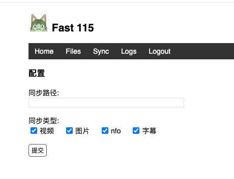
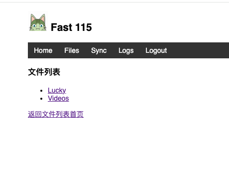
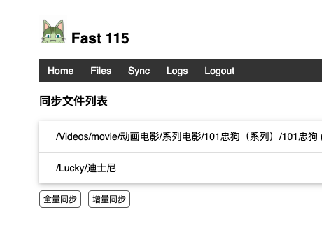
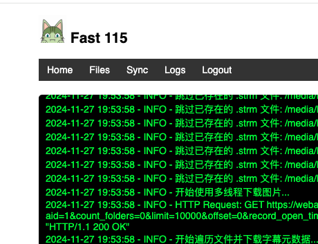

## Fast 115

`Fast 115` 主要目的是支持115 webdev和视频302服务, 方便视频刮削浏览。

此项目是基于 [p115 client](https://github.com/ChenyangGao/p115client.git)。感谢 `p115 client` 作者的支持。

此项目代码及功能讨论请进 [Fast115群](https://t.me/fast_115), 底层操作或者咨询其他类似项目请加入[115操作交流群](https://t.me/operate115)。

本人不懂前后端，python不熟悉，代码全靠抄。欢迎大家贡献此项目。

### 功能列表

- [x] 下载指定文件夹的图片，info文件并创建视频strm文件
- [x] 浏览器直接浏览已下载内容
- [ ] 单独删除某一个同步目录
- [x] 非原生 webdav
- [x] 在线扫码二维码登陆
- [x] 本地302服务
- [x] 登陆验证
- [x] 增量同步
- [x] fuse支持 (只读文件系统, 见注意事项)
- [ ] emby客户端302支持
- [ ] 115 tg bot
- [ ] 提升性能
- [ ] 使用异步重构代码
- [ ] 原生 webdav 支持
- [ ] 上传功能
- [ ] 更好的界面
- [ ] 更好的日志输出

### 网站样式






### 用法

docker compose:
---
```
services:
  fast115:
    image: liuhangbin/fast115:latest
    container_name: fast115
    hostname: fast115
    ports:
      - 55000:5000
    volumes:
      - /your_data_path:/data     # 数据目录，存放 cookies, logs
      - type: bind
        source: /your_media_path  # 媒体目录，存放strm 链接等, 如使用fuse请清空目录
        target: /media
        bind:
          propagation: rshared
    environment:
      - TZ=Asia/Shanghai
      - STRM_HOST=you_external_domain # strm 地址，从内部访问就内网IP, 外部访问就填外网域名
      - APP_PORT=5000 # docker映射端口，默认5000, 如果要改成其他值，请和上面的ports映射同时修改
      - SYNC_CRON="0 0 * * *" # cron 格式的定时任务
      - USERNAME=admin    # 用户名，不需要的话可以不加
      - PASSWORD=fast115  # 同上
    networks: bridge
    restart: unless-stop
    # 如果要使用webdav请添加下面的内容
    ports:
      - 55001:5001
    environment:
      - DAV_PORT=5001  # webdav端口，如果要改成其他值，请和上面的ports映射同时修改
      - FAST_STRM=yes  # 是否开启快速媒体筛选和虚拟strm, 不开启请不要添加这个变量
    # 如果要使用fuse请添加下面的内容
    # 需要host支持fuse, 默认挂载到/media, 只读文件系统, 暂时不支持后缀筛选
    # 注意: 目前无法重启自动卸载，需要关闭docker后手动卸载 /your_media_path
    environment:
      - USE_FUSE=yes
      - FAST_STRM=yes
    privileged: true
    cap_add:
      - SYS_ADMIN
    devices:
      - /dev/fuse:/dev/fuse
```

Emby usage:
---
下面以emby docker 和 fast115 docker 为例:
```
 +---------------------------------+
 |   +----------+    +---------+   |
 |   |          |    |         |   |
 |   |   Emby   |    | Fast115 |   |
 |   |          |    |         |   |
 |   +----------+    +---------+   |    NAS Server
 |       8080           8000       |
 |                                 |   192.168.1.100
 |           +---------+           |
 |           |  Nginx  |           |
 |           |   or    |  9090     |
 |           |  Lucky  |           |
 |           +---------+           |
 +---------------------------------+

        Domain: my_domain.com
```

1. 局域网方案

局域网中，访问`emby`的地址为 `http://192.168.1.100:8080`, 访问`fast115`
的地址为 `http://192.168.1.100:8000`. 则此时 `STRM_HOST` 应填
`http://192.168.1.100:8000`.

2. 外网方案

外网访问的时候，因为经过`Nginx`或者`Lucky`反代，假设emby的访问地址为
`https://emby.my_domain.com:9090`, `fast115`的访问地址为
`https://115.my_domain.com:9090`. 则此时 `STRM_HOST` 应填
`https://115.my_domain.com:9090`.

### 注意事项

1. 使用p115拉取文件会给文件打`星标`, 在意这一点的朋友请避免使用。
2. 使用fuse目前无法自动卸载，docker 如需重启，需要在关闭docker后手动卸载挂载点
   目前使用 fuse 的时候strm 路径是 domain:port/?pickcode=xxx, fast115暂时无法解析。
   临时解决方案是 docker STRM_HOST 变量设置为 STRM_HOST=https://your_domain:your_port/strm/path
3. 使用webdav必须先有数据库，如果没有数据库的话无法创建服务，需要生成数据库后重启docker

### 大佬的其他项目

[p115client](https://pypi.org/project/p115client/)
[p115updatedb](https://pypi.org/project/p115updatedb/)
[p115servedb](https://pypi.org/project/p115servedb/)
[p115tiny302](https://pypi.org/project/p115tiny302/)
[p115dav](https://pypi.org/project/p115dav/)
[python-emby-proxy](https://pypi.org/project/python-emby-proxy/)
[python-115](https://pypi.org/project/python-115/)

### 打赏

欢迎打赏 `p115 client` 作者 | 如果觉得我的项目对您有帮助，也欢迎打赏我哈
--- | ---
 | 
